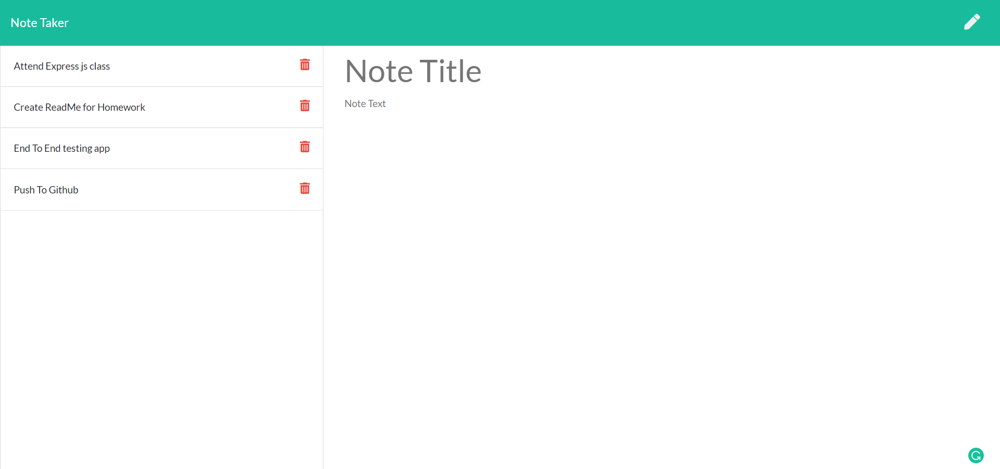

# NoteTaker

# Technologies used:
*  JavaScript, Node.js, Express.js, HTML , css, Bootstrap

# Features:

* Save user notes
* Display saved notes
* User can delete saved notes
* Generating dynamic unique id for each note in Back-end
* Implement GET, POST and DELETE end points.
* User-friendly  

# Challenges:
* Creating request and response methods in express.js

# Sample Dynamic Employee Information

# Github Repository
https://github.com/vsatyakavya/NoteTaker

# contact Information
satyakavya24@gmail.com

@copyright 2020

